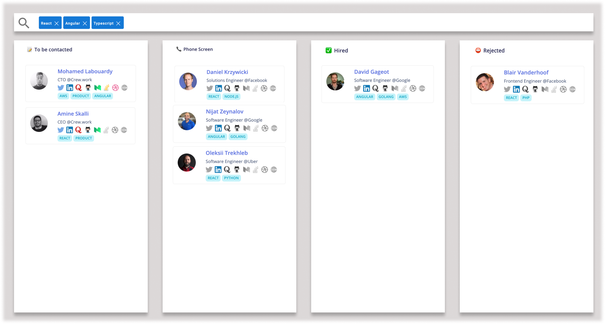

## Frontend Engineer - Coding challenge

This test is a part of our hiring process at crew.work for the Frontend Engineer position. It should take you between 1 and 3 hours depending on your experience.

**Feel free to apply! Drop us a line with your LinkedIn/GitHub/Twitter and link of your code repository at [mohamed@crew.work](mailto:mohamed@crew.work)**

At crew.work, our frontend stack consists of Angular and Typescript, but you are free to use any modern framework you wish, or do it VanillaJS style. 

> Threat this project as if you/we would continue working on this after your assignment: maintainability, scalability, and readability are super important.

## Goal

For this assignment, you are supposed to build a job pipeline in Kanban board for HR managers, where they can track the progress of job's candidates across their hiring pipeline.

To give you an idea, here how the app should look like:



HR managers can do the following:

- Drag & drop candidates from a pipeline stage to another, for instance
    - "🏁 On-site Interview" → "✅ Hired"
    - "📞 Phone Screen" → "⛔ Rejected"
   
- Filter candidates by tech stack, for instance:
    - List only experienced candidates with React & Typescript

>  Bonus: Surprise us! Add a feature that you think would work well here !

### API documentation

To fetch the list of candidates, you’ll need to make request to a publicly-available API to get JSON content and print it on Kanban board:

```json
GET https://hiring.crew.work/v1/talents
```

The above endpoints will return hundreds of candidates. You may break down or paginate the results into chunks to make the response easier to handle.

```json
GET https://hiring.crew.work/v1/talents?page=2&limit=20
```

The JSON response contains an array of candidates, each candidate has the following JSON attributes:

```json
{
        "id": "brr63adh5s5m7veepna0",
        "firstName": "Mohamed",
        "lastName": "Labouardy",
        "picture": "https://domain.com/picture.png",
        "job": "CTO @crew.work",
        "location": "Paris, France",
        "linkedin": "https://www.linkedin.com/in/mlabouardy",
        "github": "https://github.com/@mlabouardy",
        "twitter": "https://medium.com/@mlabouardy",
        "tags": [
            "Go",
            "Typescript",
            "AWS"
        ],
        "stage": "🤝 Onsite Interview"
}
```

### Submission

Create a new repo into your favorite git platform (GitHub, Gitlab, etc) with a README file containing list of instructions to run the project.

After you've finished, you can share the repository URL with us.

### Review

After you delivered the completed assignment to us, we will review it as soon as we can, generally within 24 hours. **We pay special attention to:**

- [ ] Coding skills (testable code, usage of HTML & CSS properly)
- [ ] Adopting a component-based structure with a clean modern look.
- [ ] Code organization (modularity, dependencies between modules, naming, etc)
- [ ] Overall code quality (edge cases, usage of tools, performance, best practices)

### Good luck,
